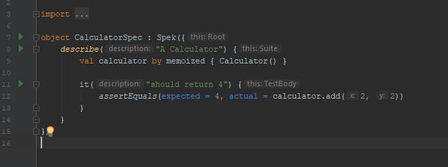
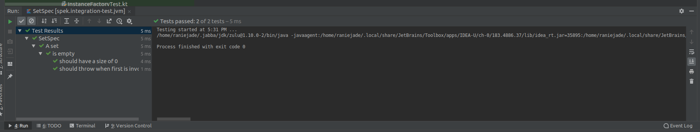

### Gradle
Tests can be run by just invoking the `test` task (`gradlew test`). Currently, there
is no way to run a specific test via Gradle.

### IDE  
   
To run tests in IntelliJ IDEA or Android Studio you need to install [Spek Framework plugin](https://plugins.jetbrains.com/plugin/10915-spek-framework) (search for `Spek Framework`).

!!! info 
    Running tests for Android projects in IntelliJ IDEA is not supported, please use Android Studio.

The plugin will allow you to:

- Run all tests in a package (there should be an option under `Run` -> `Spek tests in <package>` when right clicking a package in the explorer)
- Run specific scope via the gutter icons.
  
- See at a glance failed tests from the reporting window.
  
- Navigate to the failing test via the test tree (Right click the failing entry then `Jump to Source` or press `F4`). Do note that
  `Jump to Source` does not work if you run all tests within a package. 